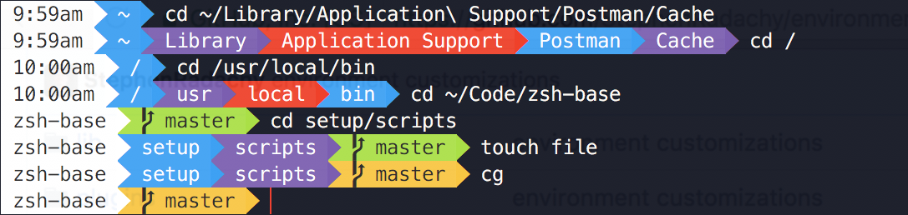

# Environment



My Mac OS terminal configuration plus some other goodies. Based off of https://github.com/StephenRadachy/zsh-base

## Unique Features
- Color-coded path relative to the root directory, your home directory, or any git repository
- Lots of [tasty software](setup/scripts/01-homebrew.zsh)
- Powerline fonts (installed to ```/tmp/fonts```)
- iTerm2 color schemes (installed to ```/tmp/iTerm2-Color-Schemes```)

## Recommended Configuration
- Emulator: iTerm2
- Font: 13pt inconsolata for Powerline
- Color scheme: Argonaut

## Prerequisites
- zsh ([instructions](https://github.com/robbyrussell/oh-my-zsh/wiki/Installing-ZSH))
- git
- curl
- homebrew ([instructions](https://brew.sh/))

## Instructions
- Clone this repo
- Run ```./install```
- PROFIT
